# Sign Language Interpreter (Real Time Webcam Version)

For the photo detection version with deployment to the Streamlit Cloud, please click this [link](https://github.com/rahimnasir/sign-language-interpreter-photo) to go to the repository.

## Instruction
1. Clone the repository
```
git clone https://github.com/rahimnasir/sign-language-interpreter-com-vis-llm.git
```
2. Open Anaconda Prompt and choose your environment for the streamlit local application. If the environment has no reqired libraries, install the required libraries.
3. Open another Anaconda Prompt and choose the environment with Langflow installed. If the environment has no Langflow installed, install Langflow into the environment
4. Use the command to run Langflow
```
langflow run
```
5. After Langflow is opened, import the JSON which contain the Langflow chatbot for the application into Langflow. The imported bot doesn't have OpenAI API Key. Please insert the OpenAI API Key.
6. Go to the directory and run the python file as streamlit local application.
```
streamlit run sign_language_interpreter_app.py
```
7. Enable the camera and enjoy doing the gesture!
## Gesture List
- Apple 

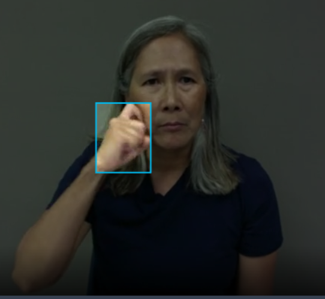

- Can

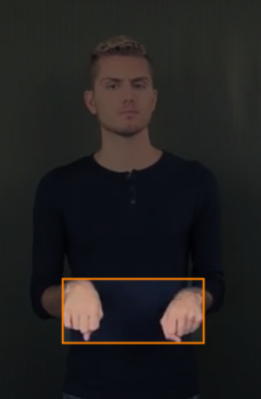

- Get

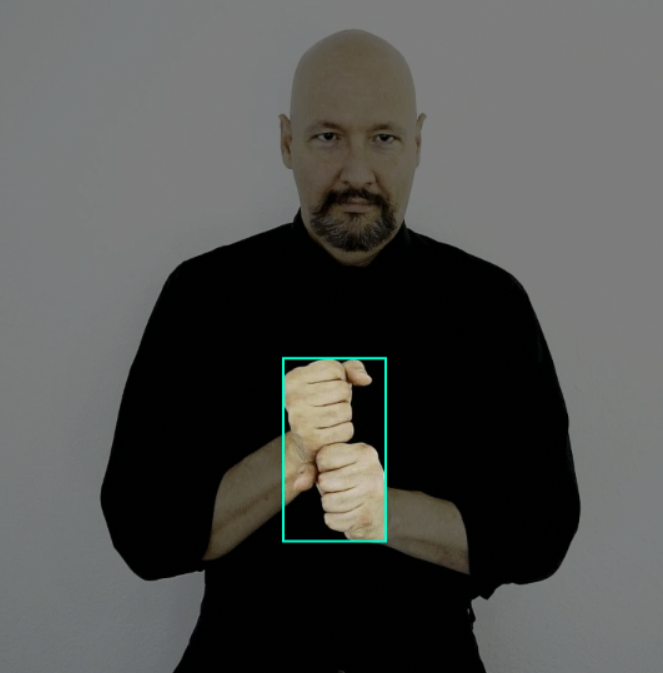

- Good

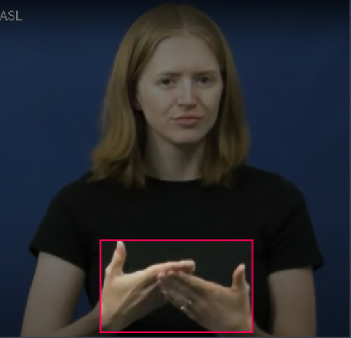

- Have

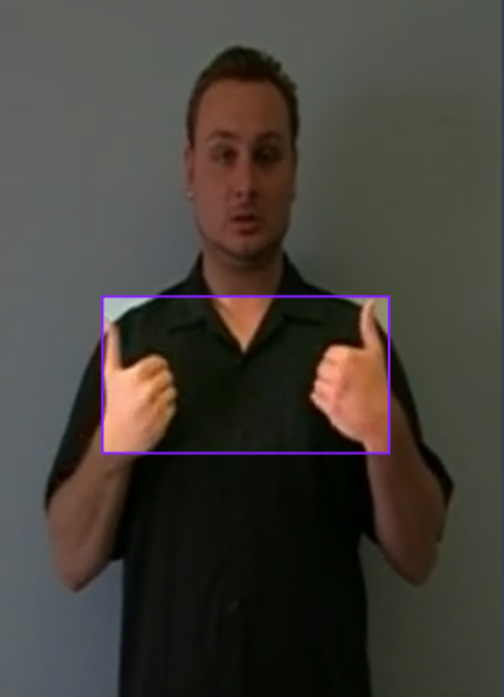

- Help

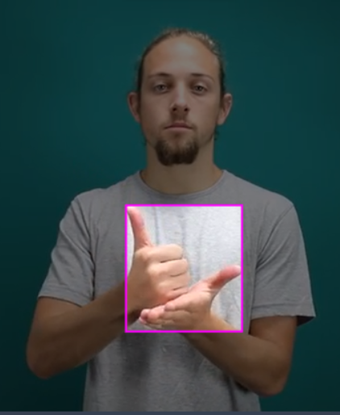

- How

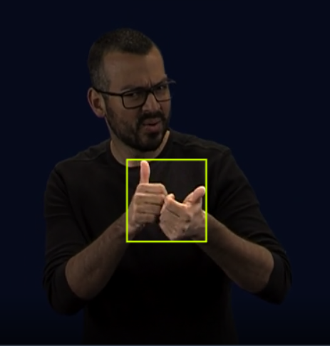

- I

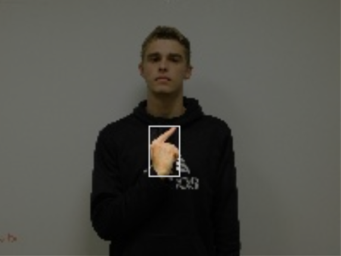

- Like

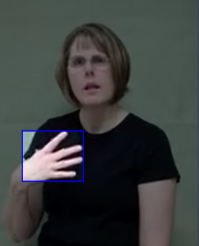

- Love

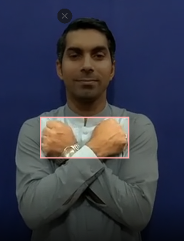

- My

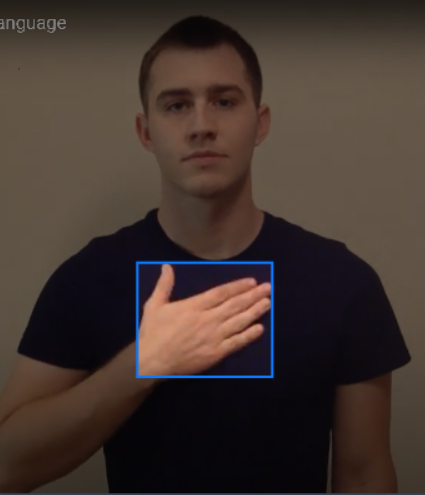

- No

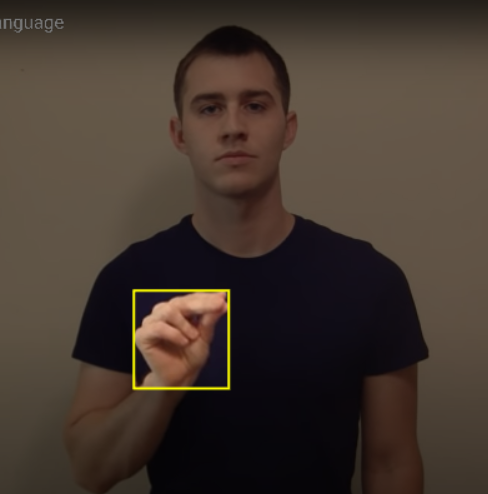

- Sorry

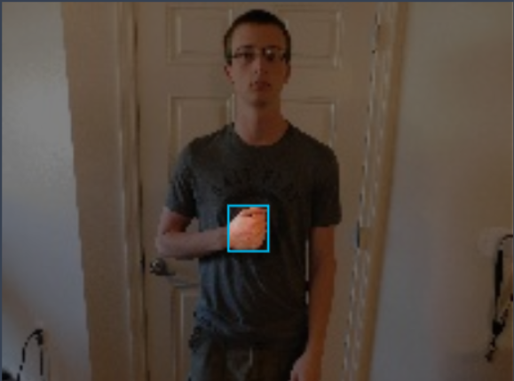

- Thank You

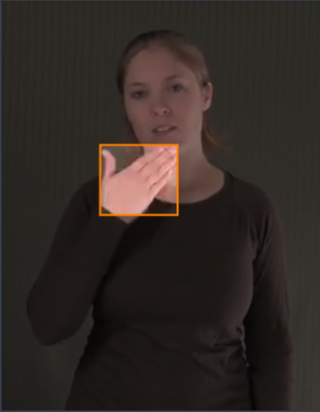

- Want

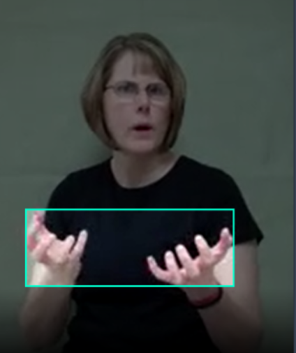

- Yes

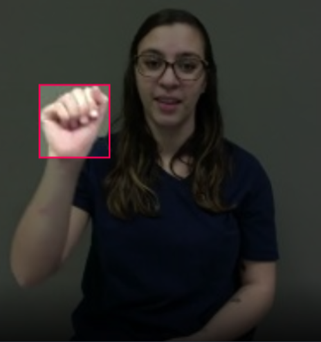

- You

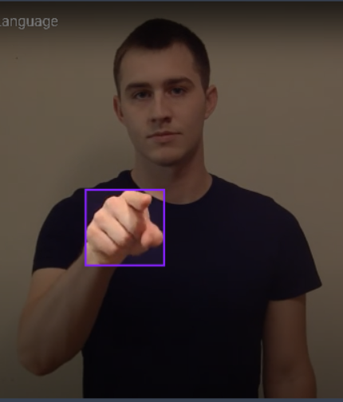

- Your

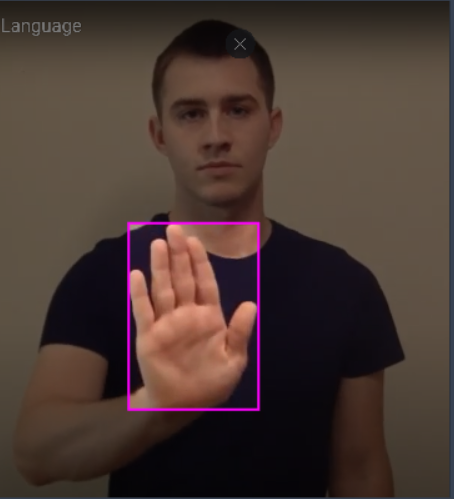


## Dataset
Roboflow Dataset: [ASL Dataset Computer Vision Project](https://universe.roboflow.com/asl-dataset/asl-dataset-p9yw8) by Cole Belfry.

ASL Website Dictionary: [SignASL.org](https://www.signasl.org)
